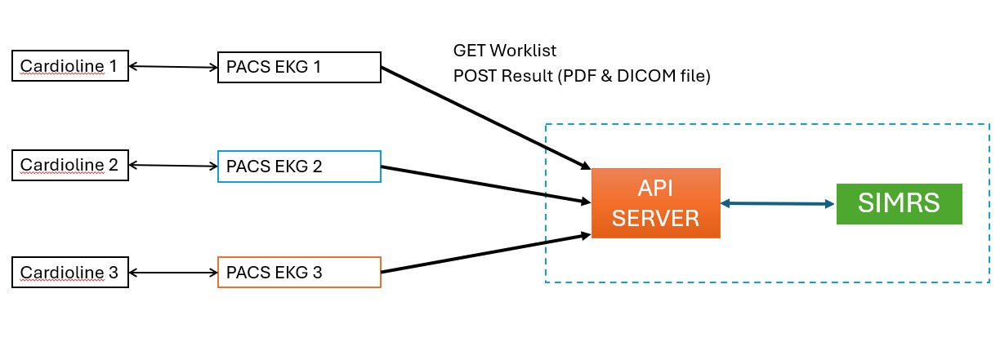

# 📄 Dokumentasi Teknis REST API Server untuk Integrasi PACS EKG Client dengan SIMRS

## 1. Ringkasan Sistem

API ini bertugas sebagai penghubung antara:

- **SIMRS (Sistem Informasi Manajemen Rumah Sakit)**
- **PACS EKG Client**, yaitu aplikasi lokal di laptop/komputer yang terhubung dengan alat EKG **Cardioline**

Dengan REST API ini, informasi daftar pemeriksaan EKG (Patient Worklist) dapat dikirimkan secara otomatis dari SIMRS ke alat Cardioline (melalui PACS EKG Client), dan hasil pemeriksaan dari Cardioline dapat dikembalikan ke SIMRS (dalam bentuk file PDF).

API Server disediakan dan diimplementasikan oleh tim IT rumah sakit sesuai dengan dokumentasi teknis yang telah disepakati.

---

## 2. Tujuan API

1. **GET Worklist**  
   Mengambil data pemeriksaan EKG (Patient Worklist) dari SIMRS untuk PACS EKG Client.

2. **POST Result**  
   Mengirim hasil pemeriksaan EKG (PDF dan DICOM) dari PACS EKG Client ke SIMRS.

---

## 3. Arsitektur Sistem



Diagram berikut menggambarkan alur komunikasi antara SIMRS, API Server, dan PACS EKG Client:

**Komponen:**

- Cardioline : Alat EKG yang terhubung ke PACS EKG Client melalui protokol DICOM.

- PACS EKG Client Aplikasi desktop/laptop yang menangani:

  - Komunikasi dengan EKG Cardioline:

    - Mengirim worklist ke Cardioline (DICOM Modality Worklist)

    - Menerima hasil EKG dari Cardioline (format PDF)

    - Menyimpan hasil pemeriksaan secara lokal

  - Komunikasi dengan SIMRS melalui API Server

    - Mengambil daftar worklist dari API Server (GET)

    - Menyimpan hasil pemeriksaan ke API Server (POST)

- API Server: Server REST API yang menangani:

  - GET data worklist EKG dari SIMRS

  - POST hasil pemeriksaan ke SIMRS

- SIMRS: Sistem utama rumah sakit, menyimpan data pasien dan rekam medis.

## 4. Detail Endpoint API

### 🔹 GET /api/worklist

#### Fungsi

Mengambil daftar pemeriksaan (worklist) dari SIMRS untuk dikirim ke alat EKG melalui PACS EKG Client.

#### Request

- **Method:** `GET`
- **Authorization:** Optional (disarankan menggunakan token)

#### Response

- **Content-Type:** `application/json`
- **Body:**

```json
[
  {
    "NoPemeriksaan": "360666",
    "NoRekamMedis": "AC14918",
    "NamaDepan": "Anita",
    "NamaBelakang": "S",
    "JenisKelamin": "F",
    "Berat": "",
    "TanggalLahir": "2020-02-01",
    "KodeAlat": "CARDIO1",
    "NamaRuang": "Poli01",
    "NamaDokter": "dr. Eko N."
  },
  {
    "NoPemeriksaan": "360777",
    "NoRekamMedis": "BD123",
    "NamaDepan": "Martin",
    "NamaBelakang": "K",
    "JenisKelamin": "M",
    "Berat": "",
    "TanggalLahir": "2010-01-01",
    "KodeAlat": "CARDIO1",
    "NamaRuang": "Poli01",
    "NamaDokter": "dr. Eko N."
  }
]
```

#### 🧾 Field Wajib

| Nama Field    | Tipe         | Keterangan                          |
| ------------- | ------------ | ----------------------------------- |
| NoPemeriksaan | String       | Nomor unik pemeriksaan              |
| NoRekamMedis  | String       | Nomor rekam medis pasien            |
| NamaDepan     | String       | Nama depan pasien                   |
| NamaBelakang  | String       | Nama belakang pasien                |
| JenisKelamin  | "M"/"F"      | Jenis kelamin pasien (Male /Female) |
|               | atau "L"/"P" | atau (Laki-laki / Perempuan)        |
| TanggalLahir  | yyyy-mm-dd   | Tanggal lahir pasien                |
|               | dd/mm/yyyy   |                                     |
| KodeAlat      | String       | Kode alat Cardioline yang digunakan |

#### Catatan

Nama field bisa diganti selama maknanya tetap sama, karena PACS EKG Client **mendukung pemetaan dari nama field** yang digunakan oleh pihak RS dengan nama field Standard DICOM yang digunakan oleh alat EKG Cardioline

### 🔹 POST /api/result

#### Fungsi

Menerima hasil pemeriksaan EKG dari PACS EKG Client, berupa file PDF dan DICOM (**Base64 encoded**), serta metadata pasien dan pemeriksaan.

#### Request

**Method:** `POST`

**Content-Type:** `application/json`

**Body:**

```json
{
  "NoPemeriksaan": "1234567",
  "NoRekamMedis": "AC98765",
  "NamaPasien": "Dian Utami",
  "TanggalLahir": "1995-04-20",
  "JenisKelamin": "F",
  "KodeAlat": "CARDIO1",
  "StudyDate": "2024-06-25",
  "StudyTime": "12:30:00",
  "AcquisitionDateTime": "2024-06-25 12:30:00",
  "StudyInstanceUID": "1.2.840.113564.1234.1954.123456.123456",
  "PdfFile": "JVBERi0xLjcKCjQgMCBvYmoKKElkZW50aXR5KQplbmRvY...",
  "DicomFile": "PgpzdHJlYW0KeJzsfQlgVNXV7n3vZmsZCOsCWQmMx..."
}
```

#### 🧾 Penjelasan Field

| Nama Field          | Tipe      | Keterangan                                          |
| ------------------- | --------- | --------------------------------------------------- |
| NoPemeriksaan       | String    | Nomor pemeriksaan                                   |
| NoRekamMedis        | String    | Nomor rekam medis pasien                            |
| NamaPasien          | String    | Nama lengkap pasien                                 |
| TanggalLahir        | Date      | Tanggal lahir pasien (YYYY-MM-DD)                   |
| JenisKelamin        | "M" / "F" | Jenis kelamin pasien                                |
| KodeAlat            | String    | Kode alat Cardioline yang digunakan                 |
| StudyDate           | Date      | Tanggal pemeriksaan (YYYY-MM-DD)                    |
| StudyTime           | Time      | Waktu pemeriksaan (HH:mm:ss)                        |
| AcquisitionDateTime | DateTime  | Gabungan tanggal dan waktu pemeriksaan              |
| StudyInstanceUID    | String    | Unique identifier DICOM                             |
| PdfFile             | String    | **Base64 encoded string** dari file PDF hasil EKG   |
| DicomFile           | String    | **Base64 encoded string** dari file DICOM hasil EKG |

#### Response

- **Status:** `200 OK` jika berhasil

- **Error:** `400 Bad Request` jika ada field yang salah atau tidak lengkap

---

## 5. Contoh Implementasi API (Plain PHP)

### GET /api/worklist

```php
<?php

  // Return EKG Worklist
  function getWorklist() {

    // todo: retrieve worklist from SIM-RS

    // return static worklist for example
    $worklist = [
      [
        "NoPemeriksaan"  => "66545",
        "NoRekamMedis" => "AC98765",
        "NamaDepan" => "Dian",
        "NamaBelakang" => "Utami",
        "JenisKelamin" => "F",
        "Berat" => "75",
        "TanggalLahir" => "1995-04-20",
        "KodeAlat" => "CARDIO1",
        "NamaRuang" => "Room 202",
        "NamaDokter" => "dr. John Doe",
      ],
      [
        "NoPemeriksaan"  => "66546",
        "NoRekamMedis" => "AC99834",
        "NamaDepan" => "Ali",
        "NamaBelakang" => "Armandi",
        "JenisKelamin" => "M",
        "Berat" => "65",
        "TanggalLahir" => "2001-11-15",
        "KodeAlat" => "CARDIO1",
        "NamaRuang" => "Room 202",
        "NamaDokter" => "dr. Abdullah Suherman",
      ],
      [
        "NoPemeriksaan"  => "66547",
        "NoRekamMedis" => "AC65432",
        "NamaDepan" => "Amir",
        "NamaBelakang" => "Armandi",
        "JenisKelamin" => "M",
        "Berat" => "60",
        "TanggalLahir" => "2001-11-15",
        "KodeAlat" => "CARDIO1",
        "NamaRuang" => "Room 202",
        "NamaDokter" => "dr. Abdullah Suherman",
      ],
      [
        "NoPemeriksaan"  => "66548",
        "NoRekamMedis" => "AC87123",
        "NamaDepan" => "Dina",
        "NamaBelakang" => "Armandi",
        "JenisKelamin" => "F",
        "Berat" => "50",
        "TanggalLahir" => "2001-11-15",
        "KodeAlat" => "CARDIO1",
        "NamaRuang" => "Room 202",
        "NamaDokter" => "dr. Abdullah Suherman",
      ]
    ];
    return $worklist;
  }


  if ($_SERVER['REQUEST_METHOD'] == 'GET') {

      // call get worklist function
      $users = getWorklist();

      // send json response
      header('Content-Type: application/json');
      echo json_encode($users, JSON_PRETTY_PRINT);
  }

?>
```

Kode PHP di atas adalah implementasi sederhana dari endpoint REST API untuk menangani permintaan GET yang mengembalikan daftar worklist EKG dalam format JSON. Fungsi getWorklist() mengembalikan data statis berupa array pasien yang seharusnya nanti diambil dari sistem SIMRS. Ketika API diakses dengan metode GET, server akan memanggil fungsi tersebut, lalu mengembalikan hasilnya sebagai respons JSON dengan Content-Type: application/json. Output ini kemudian bisa dikonsumsi oleh aplikasi PACS EKG Client.

### POST /api/result

```php

<?php

  // parseArchive
  // return parsed data if success, null if failed
  function parseArchive($requestBody) {

    if (!isset($requestBody['PdfFile']) || !isset($requestBody['DicomFile'])) {
      echo ("pdfFile or dicomFile not found");
      return null;
    }

    $archive=[];
    $archive['NoPemeriksaan'] = $requestBody['NoPemeriksaan'];
    $archive['NoRekamMedis'] = $requestBody['NoRekamMedis'];
    $archive['NamaPasien'] = $requestBody['NamaPasien'];
    $archive['TanggalLahir'] = $requestBody['TanggalLahir'];
    $archive['JenisKelamin'] = $requestBody['JenisKelamin'];
    $archive['KodeAlat'] = $requestBody['KodeAlat'];
    $archive['StudyDate'] = $requestBody['StudyDate'];
    $archive['StudyTime'] = $requestBody['StudyTime'];
    $archive['AcquisitionDateTime'] = $requestBody['AcquisitionDateTime'];
    $archive['StudyInstanceUID'] = $requestBody['StudyInstanceUID'];


    // Parse base64 encoded file in $requestBody['pdfFile'] and $requestBody['dicomFile']
    // using built-in PHP function base64_decode

    try {
      $archive['PdfFile'] = base64_decode($requestBody['PdfFile']);
      $archive['DicomFile'] = base64_decode($requestBody['DicomFile']);
    } catch (Exception $e) {
      echo ($e->getMessage());
      return null;
    }

    return $archive;
  }

  // storeArchive
  function storeArchive($archive) {
    // Example of Real Workflow when connected to SIM-RS
    //  1. Store archive (PDF) to the DISK / Storage
    //  2. Update information in the database
    //  3. Update worklist table, mark corresponding worklist item as COMPLETED

    // Example workflow:
    // - save the file to local storage (in folder: /archive)
    file_put_contents('archive/'.$archive['NamaPasien'] . "-" . $archive['NoPemeriksaan'].'.dcm', $archive['DicomFile']);
    file_put_contents('archive/'.$archive['NamaPasien'] . "-" . $archive['NoPemeriksaan'].'.pdf', $archive['PdfFile']);
  }


  if ($_SERVER['REQUEST_METHOD'] == 'POST') {

			header('Content-Type: application/json');
			$requestBody = json_decode(file_get_contents('php://input'), true);

			// parse archive
			$archive = parseArchive($requestBody);
			if (!$archive) {
					http_response_code(404);
					echo json_encode(['message' => 'Archive file not found']);
					break;
			}

			storeArchive($archive);

			echo json_encode(['message' => 'archive stored successfully']);
  }

?>

```

Kode PHP ini merupakan implementasi endpoint POST yang menerima data hasil pemeriksaan EKG dari PACS EKG Client dalam format JSON. Fungsi parseArchive() digunakan untuk memvalidasi dan mengekstrak data dari request body, termasuk file PDF dan DICOM yang dikirim dalam format base64. Jika salah satu file tidak ditemukan atau terjadi kesalahan saat decoding, fungsi ini akan mengembalikan null. Metadata pemeriksaan seperti NoPemeriksaan, NamaPasien, StudyDate, dan lainnya juga diparsing dari JSON dan disimpan ke dalam array $archive.

Setelah data berhasil diparsing, fungsi storeArchive() akan menyimpan file PDF dan DICOM ke dalam folder lokal bernama archive/ dengan nama file yang menggabungkan NamaPasien dan NoPemeriksaan. Dalam implementasi nyata, proses ini dapat diperluas untuk menyimpan metadata ke dalam database atau memperbarui status worklist di sistem SIMRS. Jika permintaan POST berhasil diproses, server akan membalas dengan pesan sukses dalam format JSON. Jika terjadi kesalahan, respon 404 dikembalikan beserta pesan error.
